# Architecture

## The one rule

The agent reaches the world only through `Transport`. Nothing else in the
pipeline, the snapshot shape, the prompt builder, the policy engine, the receipt
sealer, knows or cares whether the data came from a live Binance session, a
seeded fixture, or a receipt being replayed. That's what makes "live and replay
differ by one swap" a structural guarantee rather than a description of two code
paths that happen to agree today.

```mermaid
flowchart LR
    subgraph Transport["Transport (one interface, three implementations)"]
        Live["LiveTransport\nagent.binance.com/mcp/agentic"]
        Fixture["FixtureTransport\nseeded, deterministic"]
        Replay["Replay\nfrozen snapshot from a receipt"]
    end

    Transport --> Snapshot["Snapshot\nklines, book, account, frozen at capture"]
    Snapshot --> Prompt["buildPrompt()\npure function of the snapshot + charter"]
    Prompt --> Model["Model\noffline momentum, or a hosted LLM"]
    Model --> Proposal["ProposedOrder"]
    Proposal --> Policy["Policy engine\n6 arithmetic checks, not an LLM"]
    Snapshot --> Policy
    Policy --> Receipt["Receipt\nsnapshot + prompt + rawOutput + checks + outcome"]
    Receipt --> Seal["hash -> sign -> append"]
```



Text version of the same diagram, for anywhere Mermaid doesn't render:

```
  Agent OS MCP ─┐
                ├─► Transport ─► Snapshot ─► Prompt ─► Model ─► Proposal
  Fixture ──────┘                   │                              │
                                    │                              ▼
                                    │                     Policy engine
                                    │                  (deterministic, outside
                                    │                    the model's reach)
                                    ▼                              │
                                 Receipt ◄────────────────────────┘
                                    │
                            hash → sign → append
```

## Components

| Component | File | What it owns |
|---|---|---|
| `Transport` | `src/mcp/transport.ts` | The interface every data source implements: `capture()` returns a `Snapshot`, `submit()` places (or refuses to place) an order. |
| `LiveTransport` | `src/mcp/live.ts` | The only file that talks to Binance. Calls `spot.tickerPrice`, `spot.klines`, `spot.depth`, `spot.getAccount`, `spot.newOrder` against the real Agent OS MCP server. |
| `FixtureTransport` | `src/mcp/fixture.ts` | Reads a snapshot from a seeded generator or a frozen receipt. Used for the offline demo and for replay. |
| Fixture generator | `src/market/fixture-gen.ts` | `makeFixture(seed)`, a seeded PRNG (`mulberry32`) that produces the same synthetic market data for the same seed, on any machine. |
| Prompt builder | `src/agent/decide.ts` (`buildPrompt`) | A pure function of `(snapshot, charter)`. No clock reads, no ambient state, so the prompt is a deterministic function of what's already frozen in the receipt. |
| Model | `src/agent/decide.ts` (`decide`) | The offline momentum model (bit-for-bit deterministic) by default, or a hosted Claude call if `ANTHROPIC_API_KEY` is set and `--offline` isn't passed. |
| Policy engine | `src/agent/policy.ts` (`evaluate`) | Six checks against a `Charter`: notional cap, leverage cap, symbol allowlist, position concentration, open positions, losing streak. Plain arithmetic, no model call. |
| Canonical JSON + hashing | `src/receipt/canon.ts` | Recursively sorts object keys so two structurally-equal receipts hash identically on any machine. SHA-256 over the canonical form. |
| Signing | `src/receipt/keys.ts` | Ed25519 keypair generation, `signHash`/`verifyHash`. Verification needs only the public key (`agent.pub`), so a judge can check the log without any secret and without contacting anyone. |
| Store | `src/receipt/store.ts` | Append-only `data/receipts.jsonl`. `verifyLog()` reports `hashOk`, `sigOk`, and `chainOk` independently per receipt, which is what makes "tampered but still validly signed" a checkable, three-part claim rather than one pass/fail flag. |
| CLI | `src/cli/index.ts` | `keys \| fixture \| run \| replay \| verify \| tamper`, the thin layer that wires the above together for a terminal. |
| Browser verifier | `site/verify.html` | Independent port of `canon.ts`, `policy.ts`'s `evaluate()`, and `decide.ts`'s `buildPrompt()`/offline model to vanilla JS, using WebCrypto for SHA-256 and Ed25519 verification. See `DECISIONS.md` D-14 for why this is a port rather than a shared build artifact. |

## The receipt's path

1. `Transport.capture()` returns a frozen `Snapshot`, source tagged `"live"` or `"fixture"`.
2. `buildPrompt(snapshot, charter)` builds the prompt purely from that snapshot, nothing else.
3. `decide()` runs the model (offline or hosted) against that prompt and parses a `ProposedOrder`.
4. `evaluate(order, snapshot, charter)` runs the six policy checks and returns a verdict.
5. If the verdict is `allow` and `--submit` was passed, `Transport.submit()` places the order (still subject to Agent OS's own human-confirmation step on the live path). If `block`, nothing is submitted.
6. The full record, snapshot, prompt, raw model output, parsed proposal, policy checks, outcome, gets canonicalized, hashed, signed, and appended to the log with a `prev` pointer to the previous receipt's hash.

`npm run replay` reverses steps 2 through 4 against a receipt's own frozen
snapshot and diffs the result field by field against what's recorded. `npm run
verify` re-checks every receipt's hash, signature, and chain link independently.
