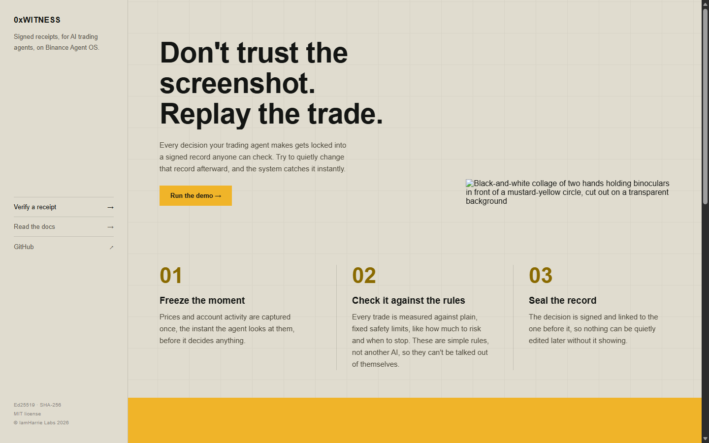
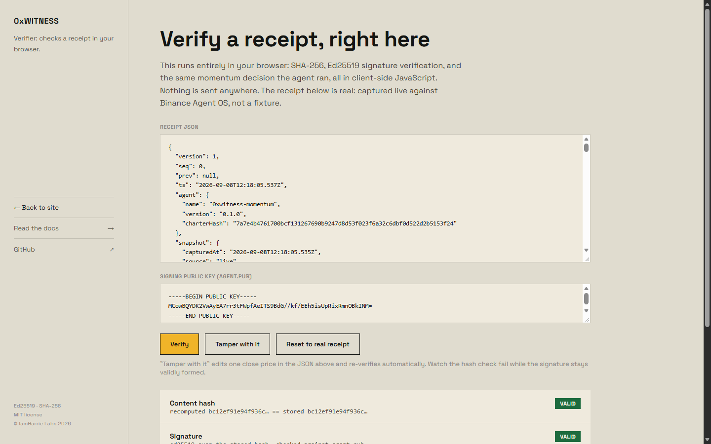

<div align="center">

# 0xWitness

### Don't trust the screenshot. Replay the trade.

[](https://github.com/IamHarrie-Labs/0xwitness/actions/workflows/test.yml)
[](LICENSE)
[](package.json)
[](DECISIONS.md#d-01-the-policy-engine-is-arithmetic-not-an-llm)
[](#running-against-live-agent-os)

A flight recorder for AI trading agents on Binance Agent OS. Every decision emits
a signed, hash-chained receipt, and anyone can re-derive it from the receipt
alone, no API key, no network, no trusting our screenshots.

**[Verify a receipt in your browser](https://0xwitness.vercel.app/verify)** · [Live site](https://0xwitness.vercel.app) · [Docs](https://0xwitness.vercel.app/docs) · [Architecture](ARCHITECTURE.md) · [Decisions](DECISIONS.md) · [Limitations](LIMITATIONS.md) · [The build story](ARTICLE.md) · [Submission checklist](SUBMISSION_CHECKLIST.md) · [Submission post](https://x.com/IamHarrie/status/2097434003028815954?s=20)



</div>

---

## Contents

- [Why this exists](#why-this-exists)
- [What broke, and what that proved](#what-broke-and-what-that-proved)
- [Who this is for](#who-this-is-for)
- [Explore without running anything](#explore-without-running-anything)
- [Verify it yourself](#verify-it-yourself)
- [What a receipt contains](#what-a-receipt-contains)
- [Architecture, in brief](#architecture-in-brief)
- [The decisions that mattered most](#the-decisions-that-mattered-most)
- [What this does not claim](#what-this-does-not-claim)
- [Running against live Agent OS](#running-against-live-agent-os)
- [Install as a skill](#install-as-a-skill)
- [Layout](#layout)
- [Notes for the Agent OS team](#notes-for-the-agent-os-team)

## Why this exists

Agent OS's own safety pitch is real: isolated sub-accounts, no withdrawal scope
ever, human confirmation on every non-read action. That solves the *authority*
problem, whether an agent is allowed to act. It does not solve the *evidence*
problem: once it has acted, what do you actually have to check its work?

When an AI trading agent loses money, the honest answer is usually a P&L number
and a vibe. The market moved, the model is nondeterministic by nature, the prompt
might have changed since. There is no way to reconstruct what it saw or why it
decided what it decided. Every hackathon entry in this space was going to compete
on the authority axis, since that's what Agent OS already gives you for free.
0xWitness answers the other one: not "was the agent allowed to trade," but "can a
stranger check, without trusting me, exactly what it saw and why it acted."

That's the whole pitch. Not "trust our agent," but "here's a signed record, go
check it yourself."

## What broke, and what that proved

The policy engine that blocks or allows a trade is deliberately arithmetic, not
another LLM: six plain checks (notional cap, leverage cap, symbol allowlist,
position concentration, open positions, losing streak). An LLM can be talked out
of a rule by a good enough prompt. Arithmetic can't be, and it replays identically
forever, which is the whole point of a receipt. Full reasoning: [D-01](DECISIONS.md#d-01-the-policy-engine-is-arithmetic-not-an-llm).

The pipeline was also built offline-first, a deterministic momentum strategy and a
seeded fixture generator, before the live API was ever touched ([D-02](DECISIONS.md#d-02-offline-first-before-the-live-api-was-ever-touched)).
When the live Binance Agent OS integration was finally wired up against a real
OAuth session, it turned out to be wrong in three separate ways that reading the
documentation alone never surfaces: the server's own setup instructions describe
one tool-naming convention (`create_spot_newOrder`) while the real API uses
another (`spot.newOrder`, [D-09](DECISIONS.md#d-09-the-live-tool-names-didnt-match-the-servers-own-documentation));
its tool list is paginated, with spot and wallet tools sitting on a second page an
integration that lists once will never see ([D-10](DECISIONS.md#d-10-toolslist-is-paginated-and-page-one-has-no-spot-or-wallet-tools));
and a piece of TypeScript syntax in the live client would have crashed on import
regardless, before a single network call, for reasons that had nothing to do with
Binance at all ([D-11](DECISIONS.md#d-11-a-typescript-syntax-choice-crashed-the-live-client-on-import)).
All three were found by actually running it against the real server instead of
trusting that careful reading was equivalent to testing. It wasn't.

Once fixed, the first real run produced something better than anything staged:
the agent captured real BTCUSDT/ETHUSDT/SOLUSDT prices, proposed selling $100 of
SOLUSDT on real momentum, and the policy engine blocked it, correctly, because the
sub-account had zero equity and the charter refused to let an undefined risk
calculation pass as a yes. A system that only ever demos the happy path hasn't
proven its safety claims. One that shows its own brakes working, on the real
exchange, has.

The same pattern showed up again with a 34-test automated suite added late in the
build: every test passed locally on the first try, and the first CI run against a
genuinely clean checkout still failed, because the folder holding the signing key
is gitignored entirely and nothing had ever created it on a fresh clone. Invisible
on the machine that already had the folder from earlier runs, immediate on CI.
Fixed and verified by moving the local data directory aside and re-running the
suite clean ([D-12](DECISIONS.md#d-12-the-test-suite-caught-a-bug-its-author-never-would-have-by-running-on-a-clean-machine)).

Full account of the build, including why 0xWitness deliberately stayed an MCP
*client* rather than also becoming a server ([D-13](DECISIONS.md#d-13-0xwitness-stayed-an-mcp-client-not-also-a-server)):
**[ARTICLE.md](ARTICLE.md)**.

## Who this is for

Anyone letting an AI agent act on a real account who wants a way to check its
work afterward without taking its word for it: someone evaluating whether to give
an agent more size, a builder auditing why a specific trade fired, or a reviewer
who wants to break a tamper claim themselves rather than read about it. It's not
a trading signal and it's not a portfolio dashboard, the bundled strategy exists
to give the receipt something real to record, not to recommend a position.

## Explore without running anything

| Open | Look for | What it establishes |
|---|---|---|
| [Live verifier](https://0xwitness.vercel.app/verify) | It loads already `VALID` / `VALID` | The default receipt is real, captured live against Binance Agent OS, not a fixture |
| Same page | Click **Tamper with it** | Content hash flips to `INVALID`, the signature stays validly formed, and the re-derived decision diverges, live, in your browser |
| [Live site](https://0xwitness.vercel.app) | Scroll to "Verify it yourself" | The exact terminal sequence below, shown as a static reference alongside the interactive one |
| [`DECISIONS.md`](DECISIONS.md) | D-09 through D-12 | The real bugs found by actually running this against a live server and a clean CI checkout, not just reading documentation |
| [GitHub Actions](https://github.com/IamHarrie-Labs/0xwitness/actions/workflows/test.yml) | Latest run | 34 tests, continuously verified on every push, not passed once and screenshotted |

## Verify it yourself

The same check, already run, in the browser verifier: a real receipt loading as
`VALID` / `VALID` against the actual signature and hash, no server involved.



Or run it yourself from a terminal:

```bash
npm run keys                       # generate the signing keypair
npm run fixture                    # deterministic market data, fixed seed
npm run run -- --offline           # one decision cycle -> receipt #0
npm run verify                     # hashes, signatures, chain
npm run replay -- --offline        # re-derive the decision from the receipt
```

Replay prints `IDENTICAL`. Now break it:

```bash
npm run tamper -- --seq 0          # edit one close price inside a sealed receipt
npm run verify                     # hash=bad, the record no longer matches its hash
npm run replay -- --seq 0 --offline # ALTERED, and the decision visibly changes
```

That is the whole claim, and you just checked it without trusting us. No install,
same check, in a browser: [0xwitness.vercel.app/verify](https://0xwitness.vercel.app/verify).

## What a receipt contains

| Field | Why it is in there |
|---|---|
| `snapshot` | Every kline, funding rate and book level the agent saw, frozen. Replay never re-fetches. |
| `snapshotHash` | Detects edits to the market data. |
| `decision.prompt` + `promptHash` | The literal prompt. Built purely from the snapshot: no clock, no ambient state. |
| `decision.rawOutput` | What the model actually said, before parsing. |
| `policy.checks` | Each deterministic charter check with its arithmetic shown. |
| `outcome` | Submitted or blocked, and why. **Blocked proposals are recorded too**: a log of only the trades you took is a highlight reel, not an audit trail. |
| `prev` + `hash` + `sig` | Hash chain plus ed25519 signature: nothing can be edited, deleted, reordered or forged. |

## Architecture, in brief

```
  Agent OS MCP ─┐
                ├─► Transport ─► Snapshot ─► Prompt ─► Model ─► Proposal
  Fixture ──────┘                   │                              │
                                    │                              ▼
                                    │                     Policy engine
                                    │                  (deterministic, outside
                                    │                    the model's reach)
                                    ▼                              │
                                 Receipt ◄────────────────────────┘
                                    │
                            hash → sign → append
```

The agent reaches the world only through `Transport`. Live and replay differ by
one swap, so reproduction is exact, not approximate. Component-by-component
breakdown, plus a Mermaid version of the diagram: **[ARCHITECTURE.md](ARCHITECTURE.md)**.

## The decisions that mattered most

Full write-ups, numbered, in [`DECISIONS.md`](DECISIONS.md). The ones that
changed how the project behaves, not just how it's phrased:

| Decision | Why it mattered |
|---|---|
| [D-01](DECISIONS.md#d-01-the-policy-engine-is-arithmetic-not-an-llm) Policy engine is arithmetic, not an LLM | A rule an LLM enforces can be argued out of by a good prompt. Arithmetic can't, and it replays identically forever. |
| [D-03](DECISIONS.md#d-03-tamper-evident-not-tamper-proof-and-the-readme-says-so) Tamper-*evident*, not tamper-*proof* | A key holder could still rewrite history wholesale. Saying so is the difference between engineering and marketing. |
| [D-05](DECISIONS.md#d-05-equityusd-is-approximated-from-the-usdt-balance-on-purpose)–[D-08](DECISIONS.md#d-08-recentpnl-is-empty-live-and-the-losing-streak-check-reads-that-as-permissive) Live account fields are honestly incomplete | `equityUsd`, `entryPrice`, and `recentPnl` all carry stated simplifications instead of confident-looking guesses. |
| [D-09](DECISIONS.md#d-09-the-live-tool-names-didnt-match-the-servers-own-documentation)–[D-11](DECISIONS.md#d-11-a-typescript-syntax-choice-crashed-the-live-client-on-import) Three real bugs found only by running live | Documentation review isn't testing. All three were invisible until an authenticated session actually hit the real server. |
| [D-12](DECISIONS.md#d-12-the-test-suite-caught-a-bug-its-author-never-would-have-by-running-on-a-clean-machine) CI caught a fresh-clone bug on its first run | `data/` doesn't exist until something creates it. Invisible on any machine that already had it; immediate on a clean checkout. |
| [D-13](DECISIONS.md#d-13-0xwitness-stayed-an-mcp-client-not-also-a-server) Stayed an MCP client, not also a server | A second server duplicates Binance's own surface rather than adding to it. Scope discipline over a longer feature list. |

## What this does not claim

Full detail, including two more limitations not summarized here, in
[`LIMITATIONS.md`](LIMITATIONS.md).

- **Bit-determinism from hosted LLMs.** Inputs are reconstructed exactly on
  replay; output divergence is surfaced, not hidden.
- **That the agent predicts markets.** The bundled strategy is a plain momentum
  rule. The contribution is the evidence layer, not the alpha.
- **A tamper-proof log.** Tamper-*evident*. A private-key holder could still
  rewrite history wholesale.
- **Custody of any kind.** Agent OS gives agents no withdrawal scope. Neither
  does this.
- **Financial advice, or a bypass of Agent OS's own confirmation step.**
  `--submit` still surfaces the order for approval in your own client. Market
  orders only, no limit, stop-loss, or take-profit types wired up.
- **A full live account picture.** `equityUsd`, `entryPrice`, and `recentPnl` on
  live snapshots all carry stated simplifications (D-05, D-07, D-08).

## Running against live Agent OS

```bash
export BINANCE_MCP_TOKEN=...        # from the Agent OS OAuth flow
npm run run -- --live               # propose only
npm run run -- --live --submit      # submit for confirmation in your client
```

Trades execute in your Agentic sub-account, which you fund manually and can revoke
at any time. `src/mcp/live.ts` is the only file that talks to Binance; everything
else is transport-agnostic.

**Verified 2026-09-08** against the real server (`Binance-MCP-Server` v1.1.0) with a
live OAuth session: real klines and prices for BTCUSDT/ETHUSDT/SOLUSDT, a real
decision, and a real policy block (the sub-account was unfunded, so
`position-pct` correctly read `n/a` against zero equity and refused the trade
rather than passing it). That exact receipt is loaded by default in the
[browser verifier](https://0xwitness.vercel.app/verify).

## Install as a skill

```bash
npx skills add https://github.com/IamHarrie-Labs/0xwitness
```

The manifest lives at [`skills/0xwitness/SKILL.md`](skills/0xwitness/SKILL.md),
mirrored to `.agents/skills/0xwitness/` and `.claude/skills/0xwitness/` (all three
are locations the `skills` CLI actually discovers). It documents every command and
links back to this README's honesty sections rather than repeating them.

## Layout

```
src/receipt/   types, canonical JSON, sha256, ed25519, append-only store
src/mcp/       transport interface, live Agent OS client, fixture replay
src/agent/     policy engine, decision layer, run loop, replay+diff
src/market/    seeded fixture generator
src/cli/       run | replay | verify | tamper | keys | fixture
site/          static marketing site (index.html, docs.html, verify.html)
test/          canon, policy, decision determinism, hash-chain tamper detection
skills/        SKILL.md manifest for `npx skills add`, mirrored to .agents/ and .claude/
ARCHITECTURE.md  component map, the receipt's full path, Mermaid diagram
DECISIONS.md     15 numbered engineering decisions, reasoning and the bugs behind them
LIMITATIONS.md   full list of what this does not claim
ARTICLE.md       first-person account of the build
SUBMISSION_CHECKLIST.md  every claim mapped to the exact command that verifies it
```

`site/index.html` is the landing page; `site/docs.html` covers the same ground as
this README in a browsable form; `site/verify.html` re-derives a receipt's hash,
signature and decision entirely in the browser via WebCrypto, no server involved.
Serve the folder with anything static, `npx serve site` works with no setup.

```bash
npm test
```

34 tests, Node's built-in test runner, no new dependency. Covers canonical JSON
ordering, every policy check at its exact boundary (not just pass/fail, the actual
threshold), offline decision determinism, and the hash-chain claim directly:
sealing a receipt, tampering with it, and asserting `hashOk` flips to false while
`sigOk` stays true, exactly the property the CLI's own tamper demo shows on
screen. One test reproduces the real live receipt's block (zero equity vetoing a
$100 SOLUSDT sell) as a plain assertion, not just a screenshot of it happening
once. Runs on every push via [GitHub Actions](https://github.com/IamHarrie-Labs/0xwitness/actions/workflows/test.yml).

Zero runtime dependencies. Node 22.6+ runs the TypeScript directly.

## Notes for the Agent OS team

Found while wiring up `src/mcp/live.ts` against the real server ([D-09](DECISIONS.md#d-09-the-live-tool-names-didnt-match-the-servers-own-documentation)–[D-11](DECISIONS.md#d-11-a-typescript-syntax-choice-crashed-the-live-client-on-import) have the full write-up), in case it's useful:

- The `initialize` response's own instructions describe tool names as a
  `{verb}_{product}_{operation}` pattern (e.g. `create_spot_newOrder`,
  `get_futures_usds_accountBalance`). The actual `tools/list` response uses dotted
  names instead (`spot.newOrder`, `futures_usds.futuresAccountBalanceV3`). An
  integration built from the prose description alone, which is the natural first
  thing to do, will call tool names that don't exist.
- `tools/list` is paginated (`nextCursor`), and it's not obvious from the first
  page: page one returns `analysis`, `convert`, `futures_coin`, `futures_usds` and
  part of `margin`: 50 tools, no `spot` or `wallet` anywhere in it. Page two is
  where `spot.*` and `wallet.*` actually live. An integration that lists once and
  stops (a reasonable thing to do) will conclude spot trading isn't exposed at all.
- Errors come back in the top-level JSON-RPC `error` field, not a per-call
  `isError` flag on the result, and `error.message` is itself a JSON string in
  Binance's own REST error format (`{"code":-1121,"msg":"Invalid symbol."}`), so
  it needs a second parse to read programmatically.
- Response shape isn't consistent across tools: some calls return `structuredContent`
  (pre-parsed JSON) alongside `content[0].text`; others (e.g. `spot.klines`) return
  only the text form, with no `structuredContent` at all. A client has to handle
  both.

---

<div align="center">

**Live site:** [0xwitness.vercel.app](https://0xwitness.vercel.app) · **Hackathon submission:** [x.com/IamHarrie](https://x.com/IamHarrie/status/2097434003028815954?s=20)

MIT.

</div>
